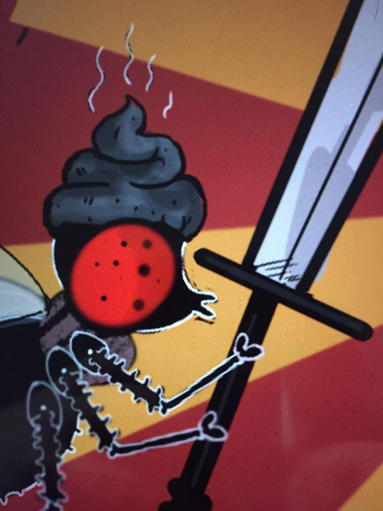
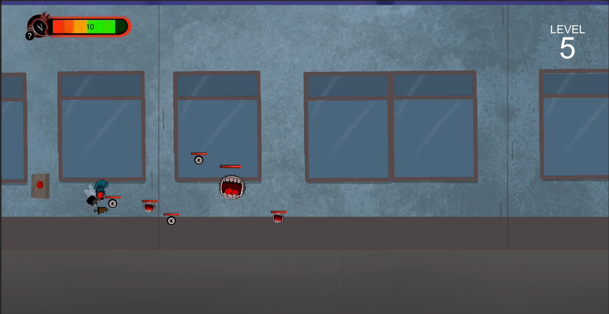

# GGSGameJamQ1

This game was developed for the [Good Game Jam 2019](https://itch.io/jam/good-game-jam), hosted at [GoodGames Studios](https://www.goodgamestudios.com/) headquarters.

## Tech
* Unity2018.3.9f1
* Visual Scripting (Flow Nodes)
* Anima 2D (Skeletal animation)

* Global Variables based on scriptable objects

## Story

We based the game on this Adventure Time episode:

https://www.youtube.com/watch?v=e41SdwWGo-o

## Screenshots

## Controls

Movement: ArrowKeys
Jump: Space, up arrow
Attack: Shift, Ctrl, q,w,e,a,s,d,z,x,c.

## Team
 - Oriana Laplana (Graphics, Animations, UI/UX, Visual Scripting)
 - Luis Rojas (Programming, Support)
 
